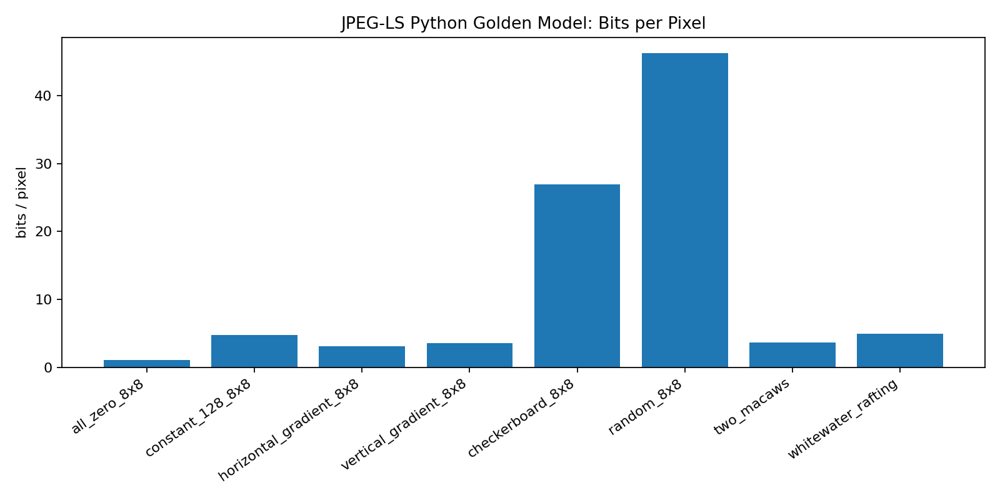
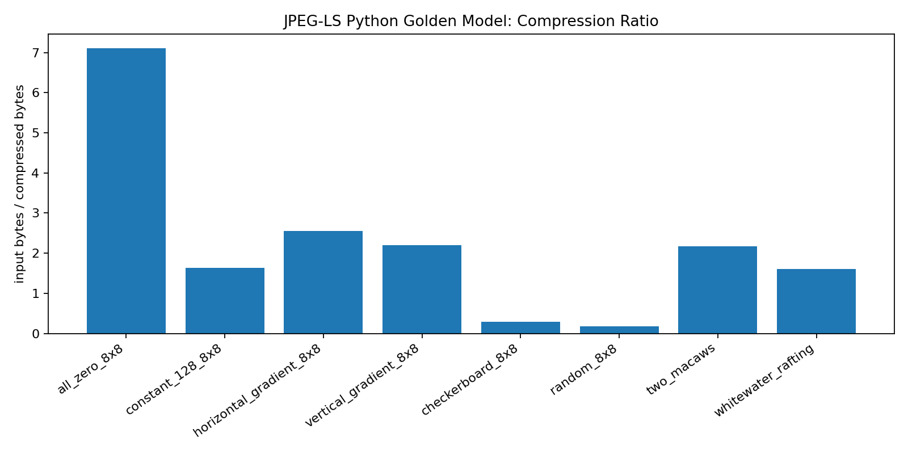

# JPEG-LS Regular-Mode Inspired Encoder IP

## Project Summary

This repository documents and evaluates a **JPEG-LS regular-mode inspired 8-bit grayscale lossless encoder datapath** for a hardware-design project.

The repository includes:

1. a Python golden-reference notebook that generates `.mem` input vectors, compressed golden outputs, trace files, CSV summaries, plots, and `submitted_results.json`;
2. a Vitis HLS implementation and self-checking C simulation testbench that verify the HLS encoder against the Python-generated golden compressed streams;
3. Vitis HLS synthesis evidence;
4. Vivado synthesized timing/utilization/power evidence;
5. completed C/RTL co-simulation evidence and Vivado out-of-context post-route implementation evidence.

> Scope note: this project is a regular-mode JPEG-LS inspired encoder core for 8-bit grayscale images. It is not a complete JPEG-LS file-container encoder. It does not implement run mode, near-lossless mode, color components, or JPEG/JPEG-LS marker segments. The HLS version exposes memory-mapped `m_axi` data ports and an `s_axilite` control interface, but it is not packaged as a complete board-level system.

> Clean grading package note: the repository intentionally excludes bulky generated Vitis/Vivado project directories and root log/journal files. The full synthesis/implementation reports are committed under `reports/`, and the relevant C/RTL co-simulation and Vivado implementation PASS lines are preserved as `reports/cosim_pass_excerpt.txt` and `reports/vivado_ooc_pass_excerpt.txt`.

For a direct rubric-to-file map, see `docs/grader_checklist.md`.

---

## Evidence Map for the Grader

| Grading Requirement | Evidence in This Repository |
|---|---|
| IP role definition | `README.md`, `docs/ip_role_definition.md` |
| Mathematical operations / data flow | `README.md`, `docs/architecture.md` |
| Scope and limitations | `docs/scope_and_limitations.md` |
| Python golden model | `stage2_jpegls_python_implementation_all_in_one.ipynb` |
| PySilicon HLS report parser notebook | `stage3_parse_hls_csynth_with_pysilicon.ipynb` |
| Python PASS summary | `submitted_results.json`, `data/python_results.csv` |
| Required real-image inputs | `images/two macaws.png`, `images/whitewater rafting.png` |
| Generated input vectors | `data/*.mem` |
| Golden compressed outputs | `data/*_compressed.mem` |
| Full trace arrays | `data/*_trace.npz` |
| Human-readable trace preview | `data/*_trace_head.csv` |
| HLS source code | `hls/jpegls_hls.cpp`, `hls/jpegls_hls.hpp` |
| HLS C testbench | `hls/jpegls_hls_tb.cpp`, `hls/jpegls_tb.hpp` |
| HLS batch script | `hls/run_hls.tcl` |
| Small C/RTL co-sim script | `hls/run_hls_cosim_small.tcl` |
| HLS implementation export script | `hls/run_hls_impl.tcl` |
| Vivado OOC implementation script | `scripts/vivado_impl_reports.tcl` |
| PySilicon/XML csynth parser script | `scripts/parse_csynth_pysilicon.py` |
| HLS C simulation results | `data/hls_csim_results.csv` |
| Small C/RTL co-sim results | `data/hls_cosim_small_results.csv`, `reports/cosim_pass_excerpt.txt` |
| HLS resource summary | `data/hls_resource_summary.csv`, `reports/hls_synthesis_summary.md` |
| Explicit throughput table | `README.md`, `data/throughput_estimates.csv` |
| Performance vs goal table | `README.md`, `data/performance_vs_goal.csv`, `docs/verification_evaluation.md` |
| HLS synthesis report | `reports/jpegls_encode_hls_csynth.rpt` |
| HLS C-synthesis XML report | `reports/csynth.xml`, `reports/jpegls_encode_hls_csynth.xml` |
| Parsed loop pipeline CSV | `data/csynth_loop_info.csv` |
| Parsed resource usage CSV | `data/csynth_resource_usage.csv` |
| Vivado synthesized timing report | `reports/vivado_synth_timing.rpt` |
| Vivado synthesized utilization report | `reports/vivado_synth_utilization.rpt` |
| Vivado synthesized power report | `reports/vivado_synth_power.rpt` |
| Vivado post-route timing report | `reports/vivado_timing.rpt` |
| Vivado post-route utilization report | `reports/vivado_utilization.rpt` |
| Vivado post-route power report | `reports/vivado_power.rpt` |
| C/RTL co-simulation PASS report | `reports/jpegls_cosim_report.md`, `reports/cosim_pass_excerpt.txt` |
| Vivado OOC post-route PASS summary | `reports/vivado_implementation_summary.md`, `reports/vivado_ooc_pass_excerpt.txt`, `reports/vivado_timing.rpt`, `reports/vivado_utilization.rpt`, `reports/vivado_power.rpt` |
| Plots | `plots/bits_per_pixel.png`, `plots/compression_ratio.png` |

---

## IP Role Definition

The intended IP is an image-compression accelerator core. It accepts an 8-bit grayscale image stream in raster-scan order and produces a variable-length compressed byte stream using a JPEG-LS regular-mode inspired predictive coding pipeline.

### HLS Top Function Interface

```cpp
void jpegls_encode_hls(
    const pixel_t *in_pixels,
    byte_t *out_bytes,
    int width,
    int height,
    int max_out_bytes,
    int *out_nbits,
    int *status
);
```

The synthesized HLS interface uses:

| Interface | Purpose |
|---|---|
| `gmem0` / `m_axi` | input pixel memory |
| `gmem1` / `m_axi` | compressed output memory |
| `gmem2` / `m_axi` | scalar output memory for `out_nbits` and `status` |
| `control` / `s_axilite` | control registers for function arguments and start/done control |
| `ap_ctrl_hs` | block-level control protocol |

### Mathematical Data Flow

For each pixel `X`, the encoder uses the causal neighborhood:

```text
C  B  D
A  X
```

The datapath is:

```text
A/B/C/D causal neighbors
        |
        v
local gradients: g1 = D - B, g2 = B - C, g3 = C - A
        |
        v
context quantization and adaptive state lookup
        |
        v
MED-style predictor
        |
        v
context correction and clipping
        |
        v
signed residual: Err = X - Px
        |
        v
mapped residual: MErr = 2*Err if Err >= 0 else -2*Err - 1
        |
        v
Golomb-style coding
        |
        v
MSB-first bit packing
```

---

## Current Result Summary

| Check | Result |
|---|---|
| Python implementation score | 10 / 10 |
| Python status | PASS |
| Python synthetic tests | 6 / 6 PASS |
| Python real image tests | 2 / 2 PASS |
| Python lossless reconstruction | PASS |
| HLS C simulation | 8 / 8 PASS |
| HLS synthesis | PASS |
| Small C/RTL co-simulation | PASS, 6 / 6 synthetic 8x8 tests |
| C/RTL evidence | `reports/cosim_pass_excerpt.txt`, `reports/jpegls_cosim_report.md` |
| Target device | `xc7z020-clg484-1` |
| Target clock | 10.00 ns |
| HLS estimated clock | 8.560 ns |
| HLS estimated Fmax | 116.82 MHz |
| Main pixel-loop latency range | 25–591 cycles/pixel from HLS loop report |
| Explicit throughput estimate | 0.169–4.000 Mpixel/s at 100 MHz; 0.198–4.673 Mpixel/s at HLS estimated Fmax |
| HLS resource usage | BRAM_18K 18, DSP 3, FF 6619, LUT 9337 |
| Parsed HLS loop pipeline info | `data/csynth_loop_info.csv` generated from `csynth.xml` |
| Parsed HLS resource table | `data/csynth_resource_usage.csv` generated from `csynth.xml` |
| Vivado synthesized reports | Present: timing, utilization, power |
| Vivado post-route OOC implementation | PASS: `place_design` and `route_design` completed successfully |
| Post-route timing | WNS 1.094 ns, TNS 0.000 ns, 0 failing endpoints, timing met |
| Post-route utilization | LUT 4898, FF 6066, RAMB36 4, RAMB18 5, DSP 3 |
| Post-route power | Total 0.161 W, dynamic 0.058 W, static 0.104 W |
| Post-route checkpoint | `reports/jpegls_post_route_ooc.dcp` |

## HLS C Simulation Results

The HLS C simulation compares the HLS output stream against the Python-generated golden compressed stream. It checks both the valid compressed bit count and each output byte.

| Test | Size | Expected compressed bytes | Expected bits | Actual bits | Result |
|---|---:|---:|---:|---:|---|
| `all_zero_8x8` | 8×8 | 9 | 68 | 68 | PASS |
| `constant_128_8x8` | 8×8 | 39 | 306 | 306 | PASS |
| `horizontal_gradient_8x8` | 8×8 | 25 | 196 | 196 | PASS |
| `vertical_gradient_8x8` | 8×8 | 29 | 225 | 225 | PASS |
| `checkerboard_8x8` | 8×8 | 216 | 1721 | 1721 | PASS |
| `random_8x8` | 8×8 | 371 | 2961 | 2961 | PASS |
| `two_macaws` | 512×768 | 180903 | 1447224 | 1447224 | PASS |
| `whitewater_rafting` | 512×768 | 244120 | 1952957 | 1952957 | PASS |

---

## HLS Synthesis Results

| Metric | Result |
|---|---:|
| Tool | Vitis HLS 2023.2 |
| Top function | `jpegls_encode_hls` |
| Target part | `xc7z020-clg484-1` |
| Target clock | 10.00 ns |
| Estimated clock | 8.560 ns |
| Estimated Fmax | 116.82 MHz |
| BRAM_18K | 18 / 280 = 6% |
| DSP | 3 / 220 = 1% |
| FF | 6619 / 106400 = 6% |
| LUT | 9337 / 53200 = 17% |
| URAM | 0 |
| RTL generated | Verilog and VHDL |
| Report | `reports/jpegls_encode_hls_csynth.rpt` |

## Performance vs Goal

This table is intentionally placed in the top-level README because the grader is instructed not to execute the design. The values below are taken from the committed HLS and Vivado reports, with the throughput values computed from the HLS-reported loop schedule.

| Goal / Metric | Target or Requirement | Evidence | Result | Status |
|---|---|---|---|---|
| HLS target clock | 10.00 ns / 100 MHz | `reports/jpegls_encode_hls_csynth.rpt` | Estimated clock = 8.560 ns; estimated Fmax = 116.82 MHz | PASS |
| Vivado OOC post-route timing | Meet 10.00 ns clock constraint | `reports/vivado_timing.rpt` | WNS = 1.094 ns; TNS = 0.000 ns; 0 failing endpoints | PASS |
| Approximate post-route frequency margin | Critical path faster than 10 ns | Computed from WNS | Approx. critical path = 10.000 - 1.094 = 8.906 ns, about 112.3 MHz | PASS |
| HLS top-level latency visibility | Report latency and explain the large data-dependent bound | `reports/jpegls_encode_hls_csynth.rpt` | 15 to 2,483,040,295 cycles; 0.150 us to 24.830 sec | PASS |
| Throughput reporting | Provide an explicit input-pixel throughput estimate | HLS inner loop latency range, `data/throughput_estimates.csv` | 0.169–4.000 Mpixel/s at 100 MHz; 0.198–4.673 Mpixel/s at 116.82 MHz | PASS |
| Real-image functional coverage | Verify the two required real images | `data/hls_csim_results.csv` | `two_macaws` and `whitewater_rafting` pass HLS C simulation | PASS |
| RTL co-simulation coverage | Show real C/RTL co-simulation PASS evidence | `reports/cosim_pass_excerpt.txt` | 6 / 6 small synthetic 8x8 tests PASS | PASS |
| Resource goal | Keep utilization modest on Zynq-7020 | HLS and Vivado reports | HLS LUT = 17%; post-route LUT = 9.2%; DSP = 3; BRAM18 equivalent = 13 post-route | PASS |

Important latency interpretation: the very large HLS maximum latency is a static upper bound caused by variable image dimensions and variable-length Golomb coding loops. It is not a timing violation. The timing goals are evaluated by the 10 ns HLS clock estimate and the Vivado post-route WNS/TNS results.

## Explicit Throughput Table

The current testbench does not log per-image RTL cycle counts, so this repository reports a transparent HLS-schedule-based throughput estimate instead of claiming measured hardware runtime. The main end-to-end bottleneck is the adaptive entropy-coded pixel loop; local helper loops can run at II=1, but the full pixel path is data-dependent because each residual can emit a different number of Golomb bits.

| Throughput Item | HLS Schedule Evidence | Cycles per Unit | Throughput at 100 MHz Target | Throughput at 116.82 MHz HLS Estimated Fmax | Notes |
|---|---|---:|---:|---:|---|
| Unary bit emission loop | `write_unary_hls`, PipelineII = 1 | 1 coding bit / cycle while active | 100.00 Mbit/s | 116.82 Mbit/s | Local loop rate only; not full-image throughput. |
| Remainder bit emission loop | `write_bits_hls`, PipelineII = 1 | 1 coding bit / cycle while active | 100.00 Mbit/s | 116.82 Mbit/s | Local loop rate only; not full-image throughput. |
| Row-buffer init/copy loops | HLS pipeline loops with II = 1 | 1 pixel / cycle while active | 100.00 Mpixel/s | 116.82 Mpixel/s | Local memory loop rate. |
| Main entropy-coded pixel loop, best reported point | Inner loop iteration latency minimum | 25 cycles / pixel | 4.000 Mpixel/s | 4.673 Mpixel/s | Best HLS-reported schedule point. |
| Main entropy-coded pixel loop, conservative reported point | Inner loop iteration latency maximum | 591 cycles / pixel | 0.169 Mpixel/s | 0.198 Mpixel/s | Conservative data-dependent schedule point. |
| End-to-end input-pixel throughput envelope | Computed from 25–591 cycles / pixel | 25–591 cycles / pixel | 0.169–4.000 Mpixel/s | 0.198–4.673 Mpixel/s | Schedule-derived estimate; 8-bit grayscale means Mpixel/s is approximately MB/s of input pixels. |

For compression-context reference, the two required real-image vectors both pass HLS C simulation: `two_macaws` is 3.680 bits/pixel and `whitewater_rafting` is 4.967 bits/pixel. These are functional compression results, not measured RTL runtime numbers.

---

## How to Reproduce

### Python Golden Model

Open:

```text
stage2_jpegls_python_implementation_all_in_one.ipynb
```

Run all cells from top to bottom. The notebook refreshes:

```text
submitted_results.json
data/python_results.csv
data/*_summary.json
data/*_compressed.mem
data/*_trace.npz
data/*_trace_head.csv
plots/bits_per_pixel.png
plots/compression_ratio.png
```

### HLS C Simulation and Synthesis

From the repository root:

```bash
vitis_hls -f hls/run_hls.tcl
```

Expected outputs:

```text
data/hls_csim_results.csv
reports/jpegls_encode_hls_csynth.rpt
reports/hls_synthesis_summary.md
```

### Parse HLS C-synthesis XML with PySilicon

The Vitis HLS C synthesis step produces XML reports. This repository includes both a notebook and a command-line script to parse the report in the same style as the course PySilicon utilities.

Notebook:

```text
stage3_parse_hls_csynth_with_pysilicon.ipynb
```

Command-line equivalent:

```bash
python scripts/parse_csynth_pysilicon.py
```

The parser looks for the generated HLS solution in:

```text
jpegls_hls_prj/solution1/syn/report/csynth.xml
```

and also supports Vitis component-style paths such as:

```text
hls_component/solution1/syn/reports/csynth.xml
```

Committed parser outputs:

```text
data/csynth_loop_info.csv
data/csynth_resource_usage.csv
```

The committed package also keeps a copy of the XML reports under `reports/` so the parsed tables remain reproducible without committing the full generated HLS project directory.

### Small C/RTL Co-simulation

The committed package includes a successful small C/RTL co-simulation run on the six synthetic 8x8 regression tests:

```bash
vitis_hls -f hls/run_hls_cosim_small.tcl
```

The run uses `-DJPEGLS_TB_SMALL_ONLY` and `-DJPEGLS_COSIM_SMALL_DEPTH` so that the RTL co-simulation wrapper uses practical m_axi depths for the small vectors. The C/RTL log ends with:

```text
INFO: [COSIM 212-1000] *** C/RTL co-simulation finished: PASS ***
```

The full 512x768 real-image vectors are intentionally verified by HLS C simulation instead of RTL co-simulation to keep RTL simulation time manageable. This is an explicit coverage boundary: the real images are claimed as Python + HLS C simulation PASS cases, while the committed C/RTL co-simulation PASS evidence is claimed only for the six small synthetic 8x8 vectors.

### Vivado Out-of-Context Implementation Reports

Run HLS synthesis first, then run Vivado OOC implementation:

```bash
vitis_hls -f hls/run_hls.tcl
vivado -mode batch -source scripts/vivado_impl_reports.tcl
```

The committed package includes completed out-of-context post-route evidence for the HLS IP. The Vivado script intentionally uses out-of-context implementation so that the wide AXI IP interfaces are not treated as physical package pins.

Committed post-route outputs:

```text
reports/vivado_timing.rpt
reports/vivado_utilization.rpt
reports/vivado_power.rpt
reports/jpegls_post_route_ooc.dcp
```

Key post-route results:

| Metric | Result |
|---|---:|
| `place_design` | completed successfully |
| `route_design` | completed successfully |
| WNS | 1.094 ns |
| TNS | 0.000 ns |
| Failing endpoints | 0 |
| Timing constraints | met |
| Total on-chip power | 0.161 W |

## Repository Layout

```text
.
├── README.md
├── .gitignore
├── Makefile
├── submitted_results.json
├── stage2_jpegls_python_implementation_all_in_one.ipynb
├── stage3_parse_hls_csynth_with_pysilicon.ipynb
├── hls/
│   ├── README.md
│   ├── jpegls_hls.cpp
│   ├── jpegls_hls.hpp
│   ├── jpegls_hls_tb.cpp
│   ├── jpegls_tb.hpp
│   ├── run_hls.tcl
│   ├── run_hls_cosim_small.tcl
│   ├── run_hls_impl.tcl
│   └── run_hls_with_cosim.tcl
├── scripts/
│   ├── vivado_impl_reports.tcl
│   └── parse_csynth_pysilicon.py
├── docs/
│   ├── grader_checklist.md
│   ├── ip_role_definition.md
│   ├── architecture.md
│   ├── verification_evaluation.md
│   ├── reproducibility.md
│   └── scope_and_limitations.md
├── reports/
│   ├── README.md
│   ├── hls_synthesis_summary.md
│   ├── jpegls_encode_hls_csynth.rpt
│   ├── jpegls_encode_hls_csynth.xml
│   ├── csynth.xml
│   ├── vivado_synth_timing.rpt
│   ├── vivado_synth_utilization.rpt
│   ├── vivado_synth_power.rpt
│   ├── jpegls_cosim_report.md
│   ├── cosim_pass_excerpt.txt
│   ├── jpegls_encode_hls_cosim_csynth.rpt
│   ├── vivado_timing.rpt
│   ├── vivado_utilization.rpt
│   ├── vivado_power.rpt
│   ├── vivado_ooc_pass_excerpt.txt
│   ├── jpegls_post_route_ooc.dcp
│   └── vivado_implementation_summary.md
├── data/
│   ├── python_results.csv
│   ├── hls_csim_results.csv
│   ├── hls_cosim_small_results.csv
│   ├── hls_resource_summary.csv
│   ├── csynth_loop_info.csv
│   ├── csynth_resource_usage.csv
│   ├── *.mem
│   ├── *_compressed.mem
│   ├── *_summary.json
│   └── *_trace_head.csv
├── images/
│   ├── two macaws.png
│   └── whitewater rafting.png
└── plots/
    ├── bits_per_pixel.png
    └── compression_ratio.png
```

---

## Plots

### Bits per Pixel



### Compression Ratio



---

## Current Limitations

- 8-bit grayscale only.
- Regular-mode inspired datapath only.
- Encoder core only.
- No JPEG/JPEG-LS file marker or container generation.
- No run mode.
- No near-lossless mode.
- No color component support.
- The Vivado implementation evidence is out-of-context IP-level evidence, not a complete board-level system integration.

## Optional Future Work

- Run full real-image C/RTL co-simulation if a longer RTL simulation budget is available.
- Package the HLS core as a reusable Vivado IP block and connect it to a Zynq processing-system design.
- Split the bit packer into a dedicated streaming stage.
- Replace the memory-mapped output buffer with an AXI4-Stream output interface if required by a larger system integration.

## C/RTL Co-simulation Status

**Yes: this package includes real C/RTL co-simulation PASS evidence.** The relevant Vitis HLS 2023.2 PASS excerpt is committed in `reports/cosim_pass_excerpt.txt`, and the detailed explanation is in `docs/cosim_status.md`.

Scope of that RTL co-simulation:

| Item | Status |
|---|---|
| Tool | Vitis HLS 2023.2 C/RTL co-simulation |
| RTL simulator | XSIM |
| RTL language | Verilog |
| Testbench mode | Small synthetic 8x8 regression |
| Result | 6 / 6 PASS |
| Final tool message | `INFO: [COSIM 212-1000] *** C/RTL co-simulation finished: PASS ***` |

The two 512x768 real images are verified in Python and HLS C simulation. They are not claimed as full-size C/RTL co-simulation cases.

